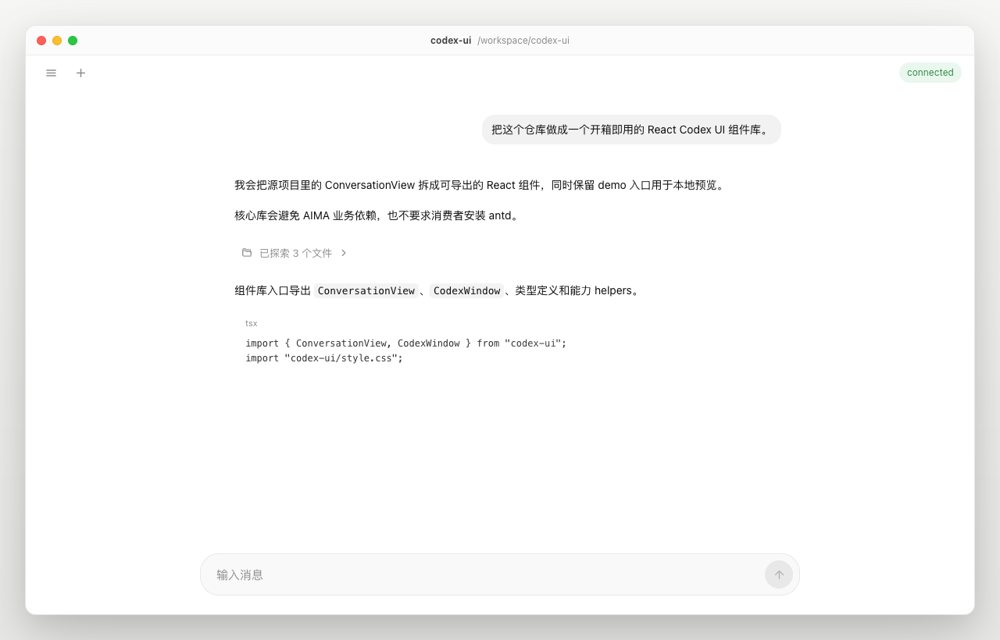
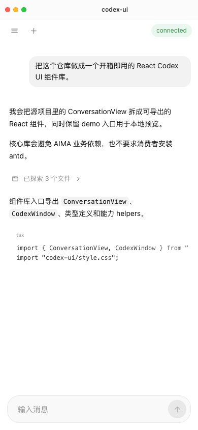

# codex-ui

开箱即用的 Codex 风格 React UI 组件库。

当前版本同步本地 `~/Desktop/code/ai/aima-workspace` 的
`src/pages/workspace/cx/components/ConversationView` 最新效果，把 Codex
桌面端会话 UI 迁移成可复用 React 组件，并提供 Vite demo 预览。

## 预览

桌面视图：



移动视图：



## 组件

- `ConversationView`: Codex 风格会话主体，包含工具条、会话抽屉、消息流、输入框和 slash command 菜单。
- `CodexWindow`: 桌面 app 风格窗口壳，可用于高保真预览。
- 类型与 helper: `ConversationMessage`、`ConversationSession`、`conversationCapabilities`、`composerPlaceholder` 等。

## 已同步的 UI 能力

- 768px 窄消息列、无卡片 assistant 回复、右侧用户气泡和底部 Codex 风格 composer。
- 工具调用折叠为 `已探索 / 已编辑 / 已运行` 的轻量摘要行，支持展开查看明细。
- 会话处理中状态、streaming 文案、长会话窗口化加载和系统 prompt 过滤。
- 内置轻量 markdown 渲染，支持代码块、列表、标题、链接和本地文件路径样式。

## 开发

```bash
npm install
npm run dev
```

打开 `http://127.0.0.1:5173/` 查看 demo。

开发模式默认会尝试读取本机 `~/.codex/session_index.jsonl` 和
`~/.codex/sessions`，用最近的本地 Codex 会话填充 demo。这个能力只在 Vite
dev server 中生效，不会进入组件库 bundle，也不会把会话内容写入仓库。README
截图使用的是脱敏 seed 数据。

如果需要使用脱敏 seed 数据预览或截图：

```text
http://127.0.0.1:5173/?source=seed
```

## 构建

```bash
npm run build
```

构建产物会输出到 `dist/`：

- `dist/codex-ui.js`
- `dist/codex-ui.umd.cjs`
- `dist/style.css`
- `dist/index.d.ts`

## 使用

```tsx
import { CodexWindow, ConversationView } from 'codex-ui';
import 'codex-ui/style.css';

export function App() {
  return (
    <CodexWindow projectName="my-codex">
      <ConversationView
        mode="live"
        ready
        status="connected"
        statusKind="ok"
        sessions={sessions}
        activeSessionId={activeSessionId}
        messages={messages}
        onSendMessage={sendMessage}
      />
    </CodexWindow>
  );
}
```
